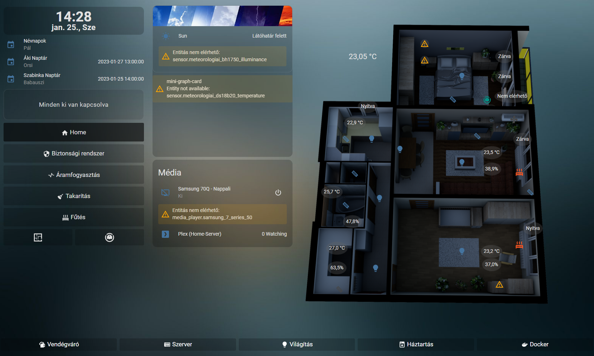
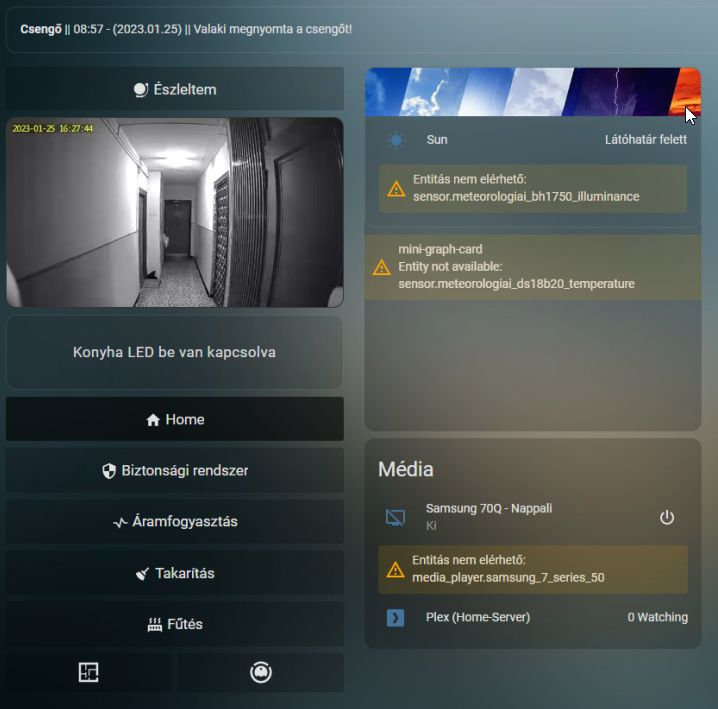

# PolyAki - my Home Assistant Configuration

I am running [Home Assistant Container](https://www.home-assistant.io/installation/#compare-installation-methods) on Unraid OS.

I have setted up following containers: [Grafana](https://hub.docker.com/r/grafana/grafana), [Influxdb](https://hub.docker.com/_/influxdb), [Telegraf](https://hub.docker.com/_/telegraf), [Plex](https://hub.docker.com/r/linuxserver/plex), [ESPHome](https://hub.docker.com/r/esphome/esphome)  

I am using a lot of [Sonoff device](https://sonoff.tech/) (BASIC/RF/TH16/POW) with flashed with [Tasmota](https://tasmota.github.io/docs/).  
I use also a lot of [Wemos D1 mini](https://www.wemos.cc/en/latest/d1/d1_mini.html) with relay (Doorbell or [Windmeter(TX23)](https://www.lacrossetechnology.com/products/tx23u) mith [BH1750](https://www.mouser.com/datasheet/2/348/bh1750fvi-e-186247.pdf) and Temp-sensor).  
I have a lot of other sensor (Waterflow, window sensor, heating system, climate and in each room temp-hum sensors). I use a different branch but in Home Assistent the can work together.

I use home assistant on two tablet and on 4 phones. The first wall mounted tablet is Huawei Mediapad M10 with [Fully Kiosk Browser](https://www.fully-kiosk.com/#get-kiosk-apps). The second tablet is Apple Ipad 4 mini. This is not mounted yet but it will be done on the next few months in the bedroom. I created two view, one fit with mobil and the otherone fit with tablets.

I have actually some issue with my Windmeter (There was a big rain and the case was not fully IP67, so the water goes in and unfortunately killed my ESP Board...) But the newone is on the way, it will be replaced, if I get it.

I inspired from:

[Matt](https://github.com/matt8707/hass-config) here you can find his awesome custom UI.  
[Luke](https://github.com/lukevink/hass-config-lajv) here you can find his awesome Floorplan.  
[IIdar](https://community.home-assistant.io/t/xiaomi-cloud-vacuum-map-extractor/231292/555) - his Xiaomi Robot solution for clean up is the best waht I have ever seen. So I implemented it.

I would like to say thank you guys. Your configuration helped me a lot.

# Installation:
This is not a theme and you will this not find in HACS.
I share with you my code.
If you want ot use, you have to implement(replace every sensor/ligth/switch with yours)

# Freatures

I have a menu card on the screen left side which is appear in each view and I also have a footer. 

If someone push the doorbell button, then it will came up in the dashboard a new card with my doorbell live stream and I will get a telegramm message - when they push the button date/time and I will also get a picture from my doorbell camera.

I have one other Alarm card what will showed if my power consuption goes over 18A. (I have only 20A in my apartment) And I will get also a telegram message. It will be showed till I don't push the "Észleltem" (I see) button. Then goes away and come back only if it will be happen again.
---Screenshot---

Xiaomi Cloudmap Extractor which is combined with my floorplan.
It showed a floorplan with the room where I can set which room should be cleared with [vacuum](https://xiaomi-store.hu/hu/porszivok/1283-xiaomi-roborock-s5-max-black-6970995781939.html). If the vacuum is started then this card will be change for the card where I see live on the floorplan where is my robot.
---Screenshot---
---Screenshot---

Heating System, there you can see three thermostat for the three rooms. I have radiators only these rooms, so this is a reason why I have only there thermostat and one for the climate.

https://www.buymeacoffee.com/polyaki
